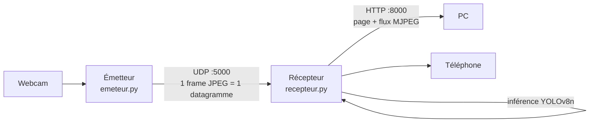

# Détection d'objets sur flux vidéo (YOLOv8n)

Projet réalisé dans le cadre de l'UE **IA03** : mise en pratique d'algorithmes d'intelligence artificielle, ici la **détection d'objets en temps réel** sur un flux vidéo transmis en réseau.

Le principe : un premier poste, l'**émetteur**, capture sa webcam et envoie le flux brut en réseau à un deuxième poste, le **récepteur**. Le récepteur effectue la détection d'objets (YOLOv8n) puis héberge un **serveur web** affichant le flux annoté en direct. Tout appareil du réseau local peut voir le résultat dans un simple navigateur.



## Fonctionnalités

- Flux vidéo annoté en direct (boîtes + étiquettes `classe + confiance`).
- Chip incrusté `FPS - N obj` et badges **FPS** / **Objets** dans la page.
- Reconnexion automatique : la page reprend le flux seule après un redémarrage du récepteur.
- Endpoints : `/` (page), `/video_feed` (flux MJPEG brut), `/fps` (JSON `{fps, objets}`).

## 1. Prérequis

- Python installé sur les postes **émetteur** et **récepteur** ; un simple navigateur suffit pour les clients.
- Toutes les machines sur le **même réseau local** (un hotspot mobile commun fait l'affaire c'est la solution utilisée pendant le développement).
- Fichiers : le poste émetteur a besoin d'`emeteur.py`, le poste récepteur de `recepteur.py` (+ `yolov8n.pt`, le modèle), et `requirements.txt` sur les deux si les librairies ne sont pas déjà installées.

## 2. Installation

Dans un terminal ouvert dans le dossier du projet, sur chaque poste :

```bash
pip install -r requirements.txt
```

## 3. Configuration

Une seule valeur à adapter : l'adresse IP du poste **récepteur**, dans `emeteur.py` (variable `TARGET_IP`).

1. Sur le poste récepteur, exécuter `ipconfig` et noter l'**adresse IPv4** de l'interface connectée au réseau local.
2. Recopier cette adresse dans `emeteur.py` :
   ```python
   TARGET_IP = '192.168.x.x'  # IP du poste récepteur
   ```
3. Rien à modifier dans `recepteur.py` (écoute sur toutes les interfaces, UDP `:5000`, web `:8000`).

> En cas de blocage, vérifier le pare-feu : autoriser l'UDP sur le port **5000** et le TCP sur le port **8000**.

## 4. Lancement et accès à l'interface

1. Lancer le récepteur (le modèle YOLO met quelques secondes à charger) :
   ```bash
   python recepteur.py
   ```
2. Lancer l'émetteur :
   ```bash
   python emeteur.py
   ```
3. Sur n'importe quel appareil du réseau local, ouvrir l'adresse indiquée dans le terminal du récepteur (`Running on http://xx.xx.xx.xx:8000`) : l'interface affiche le flux vidéo traité en temps réel.

## Dépannage

| Symptôme | Piste |
|---|---|
| Page en attente / écran noir | L'émetteur envoie-t-il bien vers la bonne IP (`Début de l'envoi vers …`) ? Pare-feu ? |
| `OSError` au démarrage du récepteur | Port 5000 déjà utilisé (autre instance en cours). |
| Saccades | Normal en Wi-Fi : UDP sans garantie, le récepteur garde toujours la frame la plus récente (faible latence > fluidité). |
| FPS / Objets à 0 | Aucune frame reçue depuis plus de 2 s : vérifier l'émetteur. |

## Fichiers du dépôt

- `emeteur.py` - capture webcam (480×360, JPEG ~40 %), envoi UDP vers `TARGET_IP:5000`.
- `recepteur.py` - réception UDP + inférence YOLO + serveur Flask (`:8000`).
- `yolov8n.pt` - poids du modèle YOLOv8 nano (léger, adapté au temps réel).
- `requirements.txt` - dépendances (`opencv-python`, `numpy`, `flask`, `ultralytics`, …).
